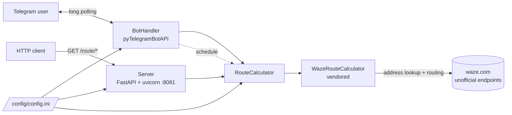

# Wazy

Wazy is a self-hosted Telegram bot that checks travel times with Waze route calculation. You
define your routes (for example home → work) in a config file. Then you tap a route in Telegram
to see the current travel time, distance and a Waze navigation link. You can also have the bot
re-check the route every few minutes and warn you when the drive takes longer than your limit.
A small REST API (FastAPI) exposes the same route checks to other applications, such as home
automation.

[](https://hub.docker.com/r/techblog/wazy)
[](LICENSE)

https://user-images.githubusercontent.com/4478920/200173402-8a8343c3-afc2-4341-86ea-c833bed98a9a.mp4

> [!WARNING]
> Wazy uses Waze's **unofficial**, undocumented web endpoints (through a vendored copy of
> [WazeRouteCalculator](https://github.com/kovacsbalu/WazeRouteCalculator)). This project is
> not affiliated with, endorsed by, or supported by Waze or Google. The endpoints can change or
> stop working at any time, and automated use may violate Waze's terms of service. Use it at
> your own risk and keep request rates low.

## Table of contents

- [Features](#features)
- [How it works](#how-it-works)
- [Requirements](#requirements)
- [Create a Telegram bot](#create-a-telegram-bot)
- [Installation](#installation)
- [Configuration](#configuration)
- [Usage](#usage)
- [REST API](#rest-api)
- [Troubleshooting](#troubleshooting)
- [Security notes](#security-notes)
- [Development](#development)
- [Contributing](#contributing)
- [Credits](#credits)
- [License](#license)

## Features

- **Check a route on demand**: `/start` shows a button for each configured route. Tap one to
  get the distance, the travel time (`HH:MM:SS` and minutes) and a Waze navigation link.
- **Maximum travel time warning**: each route has a `route.max_duration` (minutes). When the
  current travel time is longer, the reply includes a warning and how many minutes over it is.
- **Scheduled monitoring**: after a check, the bot offers to re-check the route every 5, 10, 15
  or 20 minutes and posts each result to the chat, until you tap **Cancel route monitor**.
- **Waze navigation link**: every result includes a `https://waze.to?ll=<lat>,<lon>&navigate=yes`
  link to the destination, which opens in the Waze app.
- **Named routes and addresses**: routes and saved addresses (home, work, …) live in
  `config.ini`.
- **Route options**: avoid toll roads and avoid subscription (vignette) roads, per route.
- **Regions**: Waze regions `US` (also `NA`), `EU`, `IL` and `AU`.
- **REST API**: FastAPI server on port 8081 with Swagger UI at `/docs`.
- **Docker image** for `linux/amd64`, `linux/arm64` and `linux/arm/v7`.

## How it works



- `app/app.py` loads `config/config.ini` and starts the web server in a background thread. It
  also starts the Telegram bot, but only when `bot.enabled=True`.
- The bot uses [pyTelegramBotAPI](https://pypi.org/project/pyTelegramBotAPI/) (`telebot`) with
  long polling (`infinity_polling`), so no public URL or webhook is needed.
- `RouteCalculator` turns each address into coordinates with Waze's search server, asks Waze's
  routing server for the best route (real-time traffic), and returns the time, distance and a
  navigation link.
- Scheduled checks use the [schedule](https://pypi.org/project/schedule/) library. Only one
  schedule is active at a time: setting a new interval (from any chat) replaces the previous
  job. Cancel the current monitor before you pick a new interval, though. Setting a second
  interval without cancelling the first can make the bot unresponsive until a restart (see
  [Known issues](#known-issues)).
- The configuration is read once at startup. Restart Wazy after you change `config.ini`.

## Requirements

- Docker (recommended), or Python 3 with `pip` to run from source. `ConfigParser.readfp` was
  removed in Python 3.12, so run from source on Python 3.11 or older.
  <!-- TODO: verify the Python version inside the techblog/fastapi base image -->
- A Telegram bot token from [@BotFather](https://t.me/BotFather) (only if you use the bot).
- Outbound HTTPS access to `api.telegram.org` and `www.waze.com`.

## Create a Telegram bot

Before you can use the Wazy bot, you need to create a new Telegram bot.

Open [Telegram](https://web.telegram.org/) and sign in to your account or create a new one.

Enter @BotFather in the search tab and choose this bot. (Official Telegram bots have a blue
checkmark beside their name.)

[](https://github.com/t0mer/voicy/blob/main/screenshots/scr1-min.png?raw=true "@BotFather")

Click **Start** to activate the BotFather bot.

[](https://github.com/t0mer/voicy/blob/main/screenshots/scr2-min.png?raw=true "Start")

In response, you receive a list of commands to manage bots. Choose or type the `/newbot`
command and send it.

[](https://github.com/t0mer/voicy/blob/main/screenshots/scr3-min.png?raw=true "/newbot")

Choose a name for your bot. Your subscribers will see it in the conversation. Then choose a
username for your bot. The bot can be found by its username in searches. The username must be
unique and end with the word "bot".

[](https://github.com/t0mer/voicy/blob/main/screenshots/scr4-min.png?raw=true "Username")

After you choose a suitable name, the bot is created. You receive a message with a link to your
bot (`t.me/<bot_username>`), recommendations to set up a profile picture and description, and
the bot **token**. Copy the token into `bot.token` in `config.ini`.

[](https://github.com/t0mer/voicy/blob/main/screenshots/scr5-min.png?raw=true "Bot created")

## Installation

The image is published on Docker Hub as
[`techblog/wazy`](https://hub.docker.com/r/techblog/wazy):

| Tag | Platforms |
|---|---|
| `latest`, `1.0.2` | `linux/amd64`, `linux/arm64`, `linux/arm/v7` |
| `1.0.1`, `1.0.0` | `linux/amd64`, `linux/arm64`, `linux/arm/v7` |

> The repository `VERSION` file says `1.1.2`, but the newest image on Docker Hub is `1.0.2`
> (November 2022). There are no GitHub releases or git tags yet, and no image on GHCR.

On the first start, Wazy copies a template `config.ini` into the mounted config folder. Edit it
(see [Configuration](#configuration)) and restart the container. With a bind mount such as
`./wazy`, the file is created by root, so you may need `sudo` to edit it.

### Docker Compose

```yaml
version: "3.6"
services:
  wazy:
    image: techblog/wazy
    container_name: wazy
    restart: always
    ports:
      - "8081:8081"
    environment:
      - LOG_LEVEL=DEBUG
    volumes:
      - ./wazy:/app/config
```

```bash
docker compose up -d
# edit ./wazy/config.ini, then:
docker compose restart wazy
```

### Docker run

```bash
docker run -d --name wazy --restart always \
  -p 8081:8081 \
  -e LOG_LEVEL=INFO \
  -v "$(pwd)/wazy:/app/config" \
  techblog/wazy:latest
```

### From source

`requirements.txt` does not list FastAPI and uvicorn, because the Docker base image
(`techblog/fastapi`) already provides them. Install them yourself:

```bash
git clone https://github.com/t0mer/Wazy.git
cd Wazy
python3 -m venv .venv && . .venv/bin/activate
pip install -r requirements.txt fastapi uvicorn
cd app
mkdir -p config            # Wazy copies config.ini here on first start
LOG_LEVEL=INFO python app.py
```

Run it from the `app/` directory: the config paths (`config/config.ini` and the template
`config.ini`) are relative to the working directory.

## Configuration

### Environment variables

| Variable | Default | Description |
|---|---|---|
| `LOG_LEVEL` | `DEBUG` (set in the Dockerfile) | Loguru log level: `TRACE`, `DEBUG`, `INFO`, `SUCCESS`, `WARNING`, `ERROR`, `CRITICAL`. The code has no default, so set it when you run from source. |

The Dockerfile also sets `PYTHONIOENCODING=utf-8` and `LANG=C.UTF-8`. You don't need to change
them.

### Ports and volumes

| Item | Value | Notes |
|---|---|---|
| Port | `8081/tcp` | REST API. Hard-coded in `server.py`, listens on `0.0.0.0`. |
| Volume | `/app/config` | Holds `config.ini`. Created from the template on the first start if missing. |

### config.ini

Everything else is set in `config.ini` (`/app/config/config.ini` in the container). Keys are
case-sensitive. Example with placeholder values:

```ini
[Telegram]
bot.token=<your-bot-token>
bot.allowedid=
bot.welcome.message=Hi, my name is Wazy
bot.enabled=True

[WAZE]
route.avoid_toll_roads=False
route.avoid_subscription_roads=False
route.region=IL
route.start_address=Example Street 1, Example City
route.end_address=Sample Road 10, Sample Town
route.max_duration=20
routes=["work2home","home2work"]
address=["home","work","school","parents"]

[work2home]
route.avoid_toll_roads=False
route.avoid_subscription_roads=False
route.start_address=Sample Road 10, Sample Town
route.end_address=Example Street 1, Example City
route.max_duration=20

[home2work]
route.avoid_toll_roads=False
route.avoid_subscription_roads=False
route.start_address=Example Street 1, Example City
route.end_address=Sample Road 10, Sample Town
route.max_duration=20

[ADRESSES]
address.home=Example Street 1, Example City
address.work=Sample Road 10, Sample Town
address.parents=
address.school=
```

> [!IMPORTANT]
> Two details differ from the template that ships in the image:
> - `routes` must be a JSON list with **double quotes** (`["work2home","home2work"]`). The code
>   parses it with `json.loads`, which rejects the template's single quotes.
> - Route sections must use `route.max_duration`. The template has `rout.max_duration`, which
>   the bot doesn't read.

#### `[Telegram]`

| Key | Default | Description |
|---|---|---|
| `bot.token` | *(empty)* | Bot token from @BotFather. Required when the bot is enabled. |
| `bot.allowedid` | *(empty)* | Present in the template but **not read by the code**. There is no chat allowlist. |
| `bot.welcome.message` | `Hi, my name is Wazy` | Text sent in reply to `/start` (Markdown). |
| `bot.enabled` | `False` | The bot starts only when this is exactly `True`. The REST API always starts. |

#### `[WAZE]`

| Key | Default | Description |
|---|---|---|
| `route.region` | `IL` | Waze region for every lookup: `US` (or `NA`), `EU`, `IL`, `AU`. |
| `route.start_address` | *(empty)* | Start of the default route (`/route/default`). |
| `route.end_address` | *(empty)* | End of the default route. |
| `route.avoid_toll_roads` | `False` | Avoid toll roads for `/route/default` and `/route/locations`. See [Known issues](#known-issues). |
| `route.avoid_subscription_roads` | `False` | Avoid subscription (vignette) roads for `/route/default` and `/route/locations`. See [Known issues](#known-issues). |
| `route.max_duration` | `20` | Not read by the code (the limit is set per route). |
| `routes` | `['work2home','home2work']` | JSON list of route names. Each name needs its own `[<name>]` section and becomes a button in the bot. |
| `address` | `['home','work','school','parents']` | Not read by the code. It only lists the saved address names. |

#### `[<route name>]` (one section per entry in `routes`)

| Key | Description |
|---|---|
| `route.start_address` | Start address, or coordinates as `lat,lon`. |
| `route.end_address` | Destination address, or coordinates as `lat,lon`. |
| `route.avoid_toll_roads` | Avoid toll roads. See [Known issues](#known-issues). |
| `route.avoid_subscription_roads` | Avoid subscription roads. See [Known issues](#known-issues). |
| `route.max_duration` | Maximum travel time in minutes. Longer travel times trigger a warning in the bot. |

Route names must not contain `_`, `!` or `:` anywhere, and must not be `Cancel` or `Back`. The
bot uses these in its button data and strips every `_` and `!` from the route name.

#### `[ADRESSES]`

Saved addresses for `/route/locations`, one key per address: `address.<name>=<address>`. The
section name is spelled `ADRESSES` in the code, so keep that spelling.

## Usage

### Telegram bot

The bot has one command, `/start`. Everything else happens through inline buttons:

1. Send `/start`. The bot replies with `bot.welcome.message` and a button for each route in
   `routes`.
2. Tap a route. The bot replies with:
   ```text
   Current status for home2work route is:

   Distance: 18.437
   Time to destination: 00:24:00 (24 minutes)
   Navigation URL: https://waze.to?ll=<lat>,<lon>&navigate=yes
   ```
   If the time is longer than the route's `route.max_duration`, it adds a warning with the
   number of minutes over the limit.
3. The bot asks whether you want to schedule route time checks.
   - **No** removes the question.
   - **Yes** shows interval buttons: **5**, **10**, **15** or **20 Minutes**, and **Cancel**.
4. After you pick an interval, the bot confirms and shows a **Cancel route monitor** button.
   It posts a new status message for that route at every interval.
5. Tap **Cancel route monitor** to stop. The bot replies "Route monitoring cancelled".

The bot removes its previous prompt message as you move through the steps, to keep the chat
tidy.

## REST API

The API listens on port `8081`, has **no authentication**, and serves interactive docs at
`/docs` (Swagger UI), `/redoc` and `/openapi.json` (FastAPI defaults), for example
`http://wazy:8081/docs`.

[](https://github.com/t0mer/Wazy/blob/main/screenshots/wazy.png?raw=true "Wazy REST API")

| Method | Path | Query parameters | Description |
|---|---|---|---|
| `GET` | `/route/get` | `from_address` (required), `to_address` (required), `avoid_toll_roads` (bool, default `false`), `avoid_subscription_roads` (bool, default `false`) | Travel time between two free-text addresses, such as `Raanana, Israel` and `Tel Aviv, Israel`. |
| `GET` | `/route/default` | none | Travel time for the default route (`[WAZE]` `route.start_address` → `route.end_address`). |
| `GET` | `/route/byname` | `name` (required) | Travel time for a named route section. Currently always fails, see [Known issues](#known-issues). |
| `GET` | `/route/locations` | `start` (required), `end` (required) | Travel time between two saved addresses from `[ADRESSES]`, for example `start=home&end=work`. |

All endpoints use the region from `[WAZE]` `route.region`.

Example:

```bash
curl "http://localhost:8081/route/locations?start=home&end=work"
```

Successful response (`200`); all values are strings:

```json
{
  "time": "00:24:00",
  "time_in_minutes": "24",
  "distance": "18.437 km",
  "nav_url": "https://waze.to?ll=<lat>,<lon>&navigate=yes"
}
```

On an error, the API returns `500` with a JSON-encoded **string** that contains the error
(`{"error":…}` for `/route/get`, `{"message":…}` for the others) and `"success":false`.

## Troubleshooting

- **The bot doesn't answer.** Check that `bot.enabled=True` (exactly, case-sensitive) and that
  `bot.token` is correct, then restart. Configuration is only read at startup.
- **`/start` gets no reply at all (not even the welcome text), and the logs show a JSON
  error.** Write `routes` with double quotes: `routes=["work2home","home2work"]`.
- **Tapping a route does nothing.** Check the logs. Common causes: a route name in `routes`
  without a matching `[<name>]` section, `rout.max_duration` instead of `route.max_duration`, or
  an address Waze can't resolve.
- **`Cannot get coords for <address>`**: Waze's search couldn't resolve the address in the
  configured region. Check `route.region`, make the address more specific, or use `lat,lon`
  coordinates.
- **`/route/locations` returns 500 with `No section: 'ADRESSES'`**: the section must be named
  `[ADRESSES]`, and each key must be `address.<name>`.
- **Route checks suddenly fail for every address.** Waze may have changed its unofficial
  endpoints. See the warning at the top.
- **From source, `AttributeError: 'ConfigParser' object has no attribute 'readfp'`**: use
  Python 3.11 or older.
- **From source, an error about the log level at startup**: set `LOG_LEVEL`, for example
  `LOG_LEVEL=INFO`.

### Known issues

- `/route/byname` always returns `500`: `server.py` calls `get_route_info_by_name(name=...)`,
  but the method's parameter is `route_name`.
- `route.avoid_toll_roads` and `route.avoid_subscription_roads` from `config.ini` are passed on
  as text, not booleans. As a result, a value of `False` still turns avoidance on. The
  `/route/get` query parameters are real booleans and work as expected.
- Only one scheduled check can run at a time for the whole bot.
- Each interval selection starts a blocking loop in one of the bot's two worker threads.
  Picking a second interval without first tapping **Cancel route monitor** leaves both loops
  running. The bot then stops responding, including to **Cancel route monitor**, until it is
  restarted, and status messages may be posted twice.

## Security notes

- **Keep the bot token secret.** Anyone with it can control the bot. Don't commit your
  `config.ini`, and revoke the token in @BotFather if it leaks.
- **There is no chat allowlist.** `bot.allowedid` is not enforced, so anyone who finds your bot
  can use it to check your configured routes and see those addresses. Consider this before you
  put home or work addresses in `config.ini`.
- **The REST API has no authentication** and listens on all interfaces. Don't expose port 8081
  to the internet. Keep it on a trusted network or put it behind a reverse proxy with
  authentication.
- The config volume contains your addresses and token. Protect it with file permissions and
  backups like any other secret.

## Development

Project layout:

```text
app/
├── app.py                  # entry point: starts the API and (optionally) the bot
├── bothandler.py           # Telegram bot: /start, route buttons, scheduling
├── confighandler.py        # loads config/config.ini, copies the template on first start
├── config.ini              # template configuration
├── routecalculator.py      # wraps WazeRouteCalculator, formats time and nav URL
├── server.py               # FastAPI REST API (port 8081)
└── WazeRouteCalculator.py  # vendored Waze client (see Credits)
Dockerfile                  # based on techblog/fastapi:latest, entry point app/app.py
docker-compose.yaml
requirements.txt
VERSION                     # image tag for the Docker Hub and JFrog workflows
```

Build the image locally:

```bash
docker build -t wazy:dev .
```

There are no automated tests or linters in the repository.

### GitHub Actions workflows

| Workflow | Trigger | Publishes | Platforms |
|---|---|---|---|
| `docker-publish.yml` | GitHub release published, or manual | `techblog/wazy:latest` and `techblog/wazy:<VERSION>` on Docker Hub | `linux/amd64`, `linux/arm64`, `linux/arm/v7` |
| `publish-ghcr.yml` | Manual (input `tag`, default `latest`) | `ghcr.io/t0mer/wazy:<tag>` and `ghcr.io/t0mer/wazy:latest` | `linux/amd64`, `linux/arm64`, `linux/arm/v7` |
| `docker-jcr.yml` | Manual | `<private JFrog registry>/docker/wazy:latest` and `:<VERSION>` | `linux/amd64`, `linux/arm64` |

The Docker Hub and JFrog workflows tag the image with the `VERSION` file. The GHCR workflow
uses its `tag` input instead.

## Contributing

Issues and pull requests are welcome. Please keep changes focused, describe how you tested them,
and never include real tokens or addresses in examples or screenshots.

## Credits

- [WazeRouteCalculator](https://github.com/kovacsbalu/WazeRouteCalculator) by kovacsbalu:
  `app/WazeRouteCalculator.py` is a modified copy of an older version of this library, which is
  licensed under the GNU GPL v3.0.
- [pyTelegramBotAPI](https://pypi.org/project/pyTelegramBotAPI/) for the Telegram bot.
- [FastAPI](https://github.com/fastapi/fastapi) and [uvicorn](https://www.uvicorn.org/) for the
  REST API.
- [Loguru](https://pypi.org/project/loguru/) for logging.
- [schedule](https://pypi.org/project/schedule/) for scheduled route checks.

## License

Wazy is licensed under the [Apache License 2.0](LICENSE). The vendored
`app/WazeRouteCalculator.py` comes from a project licensed under the GNU GPL v3.0.
<!-- TODO: verify how the GPL-3.0 vendored file fits with the Apache-2.0 license -->
